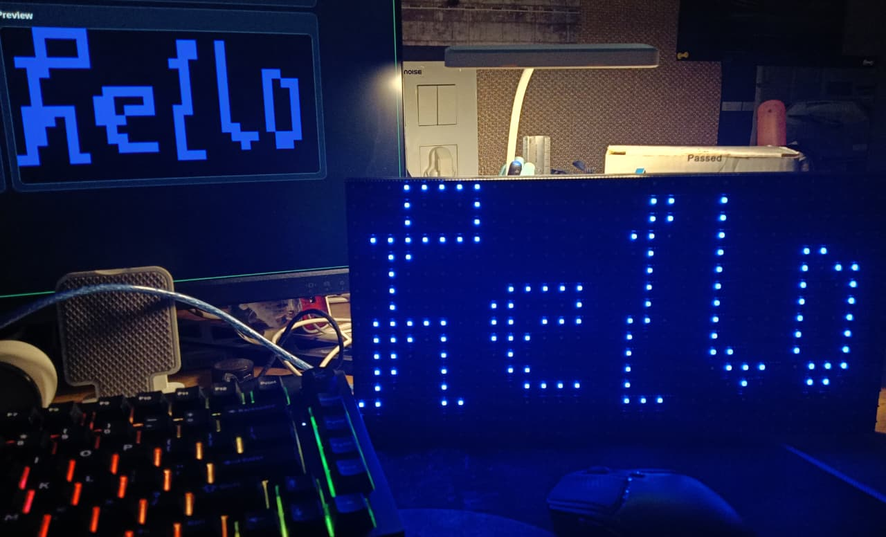

# ESP Billboard DePIN PoC

A proof-of-concept decentralized billboard system built with ESP32 and a 32x16 P10 RGB panel.



## Final Vision

The final project is a public web portal where anyone can:
1. Draw pixel art on a 32x16 canvas or upload an image.
2. Preview exactly how it will look on the physical LED panel.
3. Submit the frame online.

Behind the scenes, the system:
1. Runs NSFW filtering on submitted content.
2. Publishes approved frames to a Gateway ESP32.
3. Relays frames over ESP-NOW to the Display ESP32.
4. Renders the frame on the P10 panel in near real-time.
5. Sends periodic node health/status back to the portal.

## System Architecture

1. Frontend: React portal with 32x16 editor and preview.
2. Backend: FastAPI APIs for submission, moderation, latest frame, and health.
3. Gateway Node (ESP32): Wi-Fi + backend sync + ESP-NOW transmit.
4. Display Node (ESP32): ESP-NOW receive + HUB75 rendering on P10.
5. Transport:
   - Cloud path for production: Portal -> Backend -> Gateway -> ESP-NOW -> Display.
   - Direct serial path for development/testing.

## Hardware Stack

1. 2x ESP32 boards.
2. 1x P10 32x16 RGB LED panel.
3. 5V 10A SMPS (panel power).

## Current Scope in This Repo

1. Display firmware bring-up and panel rendering.
2. Direct frame upload tooling for testing.
3. Portal UI for drawing, image load, preview, and upload flow.
4. full gateway + ESP-NOW bridge.

## End-to-End Testing and Deployment

This section is a complete runbook for:
1. Local showcase mode.
2. Public deployment (portal and API on Vercel, protocol on devnet).

### Prerequisites

1. Node.js 18+ and npm.
2. Rust + Solana CLI + Anchor CLI.
3. uv for Python dependency management.
4. A Solana wallet browser extension (for portal signing).
5. Optional for local chain workflow: Surfpool or solana-test-validator.

### Part A: Local End-to-End Showcase

#### 1) Start local Solana RPC

Choose one:

```bash
surfpool start
```

or

```bash
solana-test-validator
```

Keep this terminal running.

#### 2) Build and deploy the protocol to localnet

```bash
cd solana_protocol
anchor build
anchor deploy --provider.cluster localnet
```

#### 3) Initialize protocol config PDA (treasury + price)

From `solana_protocol/`:

```bash
npm install
npm run init:config
```

Optional overrides:

```bash
RPC_URL=http://127.0.0.1:8899 WALLET=~/.config/solana/id.json LAMPORTS_PER_PIXEL=2000 TREASURY=<TREASURY_PUBKEY> npm run init:config
```

Check status without writing:

```bash
npm run show:config
```

#### 4) Set frontend env for local run

Create/update `portal/.env.local`:

```env
VITE_SOLANA_REQUIRED=true
VITE_SOLANA_RPC_URL=http://127.0.0.1:8899
VITE_SOLANA_PROGRAM_ID=<YOUR_LOCAL_PROGRAM_ID>
VITE_SOLANA_COMMITMENT=confirmed
VITE_DEFAULT_LAMPORTS_PER_PIXEL=2000
VITE_MODERATION_URL=/api/moderate
```

#### 5) Set backend env for local run

Create/update `portal/api/.env`.

Example with Sightengine:

```env
MODERATION_PROVIDER=sightengine
SIGHTENGINE_API_USER=<YOUR_USER>
SIGHTENGINE_API_SECRET=<YOUR_SECRET>
GOOGLE_VISION_DISABLED=false
```

Or disable provider calls for local dry-runs:

```env
GOOGLE_VISION_DISABLED=true
```

#### 6) Run API and portal

Terminal A (API):

```bash
cd portal/api
uv sync
uv run uvicorn index:app --reload --host 127.0.0.1 --port 8000
```

Terminal B (portal):

```bash
cd portal
npm install
npm run dev
```

#### 7) Local smoke test checklist

1. Open portal in browser.
2. Connect wallet.
3. Confirm Solana status shows config loaded.
4. Draw or upload image.
5. Connect gateway (serial).
6. Click upload and approve wallet signature.
7. Verify moderation result and gateway send success.

### Part B: Deploy Protocol to Devnet

#### 1) Configure wallet and fund devnet

```bash
solana config set --url devnet
solana airdrop 2
```

#### 2) Deploy protocol

```bash
cd solana_protocol
anchor build
anchor deploy --provider.cluster devnet
```

Save the resulting program ID.

#### 3) Initialize devnet config

```bash
cd solana_protocol
RPC_URL=https://api.devnet.solana.com PROGRAM_ID=<YOUR_DEVNET_PROGRAM_ID> LAMPORTS_PER_PIXEL=2000 npm run init:config
```

Verify:

```bash
RPC_URL=https://api.devnet.solana.com PROGRAM_ID=<YOUR_DEVNET_PROGRAM_ID> npm run show:config
```

### Part C: Deploy Portal and API to Vercel

#### 1) Deploy from portal directory

```bash
cd portal
vercel
```

This repo already has `portal/vercel.json` configured for Vite output + Python API route rewrite.

#### 2) Set Vercel environment variables

Frontend env vars:

```env
VITE_SOLANA_REQUIRED=true
VITE_SOLANA_RPC_URL=https://api.devnet.solana.com
VITE_SOLANA_PROGRAM_ID=<YOUR_DEVNET_PROGRAM_ID>
VITE_SOLANA_COMMITMENT=confirmed
VITE_DEFAULT_LAMPORTS_PER_PIXEL=2000
VITE_MODERATION_URL=/api/moderate
```

Backend moderation env vars (choose provider):

Sightengine example:

```env
MODERATION_PROVIDER=sightengine
SIGHTENGINE_API_USER=<YOUR_USER>
SIGHTENGINE_API_SECRET=<YOUR_SECRET>
```

Google Vision example:

```env
GOOGLE_APPLICATION_CREDENTIALS_JSON_BASE64=<BASE64_JSON>
GOOGLE_VISION_DISABLED=false
```

Redeploy after adding env vars.

#### 3) Post-deploy verification checklist

1. Open deployed portal URL.
2. Connect wallet on devnet.
3. Confirm price source is on-chain in UI.
4. Submit a test frame and approve wallet signature.
5. Confirm moderation source in API response behavior.
6. Confirm gateway/display receive path for your hardware setup.

### Notes and Operational Tips

1. `initialize` is one-time per program ID and cluster; re-running script is safe and will no-op if already initialized.
2. If local init fails with debit or prior credit errors, the payer wallet has no lamports on that local RPC. Fund wallet or use the script's localnet airdrop path.
3. The portal can be public and permissionless; consider API rate limiting and operational safeguards before public demos.

## LICENSE

[MIT LICENSE](./LICENSE)
